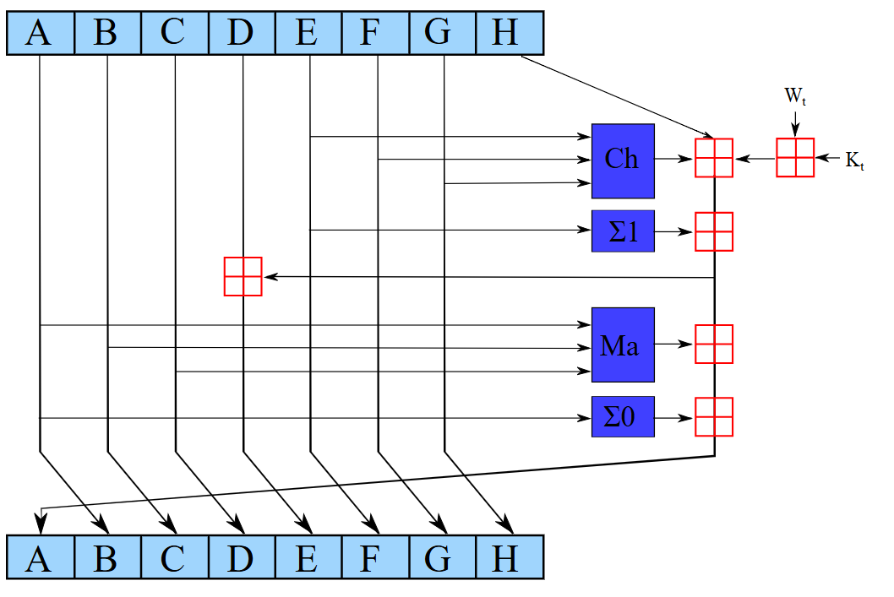
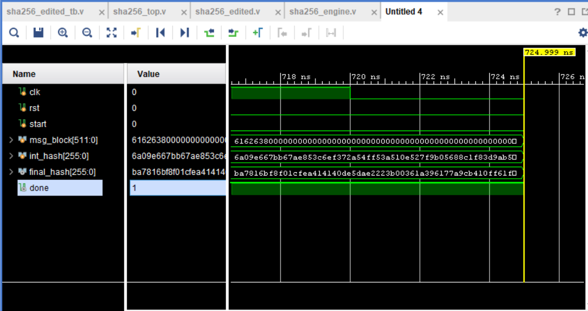

# SHA-2 Project Report - VLSI Circuits for Signal Processing

**Authors:**  
- Vanama Sai Srinivas (EE22B052)  
- Chintham Ashwath Reddy (EE22B009)  
**Department:** Electrical Engineering,  
**Institution:** Indian Institute of Technology Tirupati  

---

## Abstract

This project documents the implementation of the SHA-256 hashing algorithm from the SHA-2 family using Verilog HDL. The design includes the full datapath, control FSM, and verification with testbenches and waveform analysis.

---

## 1. Introduction

Secure Hash Algorithms are cryptographic hash functions widely used in authentication, blockchain, and digital signatures. SHA-2, particularly SHA-256, is known for its security and hardware efficiency. This project aims to implement the SHA-256 algorithm using Verilog.

---

## 2. Objectives

- Understand the internal structure of the SHA-256 algorithm.
- Develop Verilog modules for:
  - Message padding
  - Message schedule
  - Compression function
  - Final hash output
- Design an FSM controller for sequential execution.
- Verify the functionality via testbenches and waveform simulations.

---

## 3. Overview of SHA-256

SHA-256 operates on 512-bit blocks and produces a 256-bit output. The algorithm consists of:
- Message Padding and Parsing
- Message Schedule Expansion (64 words)
- Compression Loop (64 rounds)
- Hash Update with Initial Hash Values


*Figure 1: Block Diagram of SHA-256 Algorithm*


*Figure 2: Message Padding and Compression Function*

---

## 4. Architecture Design

The architecture consists of:
- A datapath module for 32-bit logical and arithmetic operations.
- Registers for intermediate values (A to H).
- A ROM for constants `K_t`.
- A 64-entry message schedule buffer.
- An FSM for controlling operations in each round.

### 4.1 Datapath Design

Handles word operations such as right rotation, shifting, XOR, AND, and addition modulo $2^{32}$. It is modularized to simplify testing.

### 4.2 Control FSM

Controls:
- Initialization
- Message schedule loading
- Compression iterations (rounds)
- Final hash computation

---

## 5. Simulation and Verification

Testbenches were written to verify each module using sample test vectors from NIST. Simulation was carried out in Vivado.


*Figure 3: Simulation waveform of SHA-256 Testbench*

---

## 6. SHA-256 Pseudocode (Python)

```python
import struct

# Constants
K = [0x428a2f98, 0x71374491, ..., 0xc67178f2]  # truncated for brevity

def ROTR(x, n): return ((x >> n) | (x << (32 - n))) & 0xFFFFFFFF
def SHR(x, n): return x >> n

def Ch(x, y, z): return (x & y) ^ (~x & z)
def Maj(x, y, z): return (x & y) ^ (x & z) ^ (y & z)
def Sigma0(x): return ROTR(x, 2) ^ ROTR(x, 13) ^ ROTR(x, 22)
def Sigma1(x): return ROTR(x, 6) ^ ROTR(x, 11) ^ ROTR(x, 25)
def sigma0(x): return ROTR(x, 7) ^ ROTR(x, 18) ^ SHR(x, 3)
def sigma1(x): return ROTR(x, 17) ^ ROTR(x, 19) ^ SHR(x, 10)

def sha256_compress(msg_block_512, hash_input_256):
    W = [int.from_bytes(msg_block_512[i*4:(i+1)*4], 'big') for i in range(16)]
    for i in range(16, 64):
        W.append((sigma1(W[i - 2]) + W[i - 7] + sigma0(W[i - 15]) + W[i - 16]) & 0xFFFFFFFF)

    a, b, c, d, e, f, g, h = [int.from_bytes(hash_input_256[i*4:(i+1)*4], 'big') for i in range(8)]

    for i in range(64):
        T1 = (h + Sigma1(e) + Ch(e, f, g) + K[i] + W[i]) & 0xFFFFFFFF
        T2 = (Sigma0(a) + Maj(a, b, c)) & 0xFFFFFFFF
        h, g, f, e, d, c, b, a = g, f, e, (d + T1) & 0xFFFFFFFF, c, b, a, (T1 + T2) & 0xFFFFFFFF

    H = [int.from_bytes(hash_input_256[i*4:(i+1)*4], 'big') for i in range(8)]
    for i, val in enumerate([a, b, c, d, e, f, g, h]):
        H[i] = (H[i] + val) & 0xFFFFFFFF

    return b''.join(h.to_bytes(4, 'big') for h in H)

# Example usage
if __name__ == "__main__":
    initial_hash = b''.join([
        b'\x6a\x09\xe6\x67', b'\xbb\x67\xae\x85', b'\x3c\x6e\xf3\x72', b'\xa5\x4f\xf5\x3a',
        b'\x51\x0e\x52\x7f', b'\x9b\x05\x68\x8c', b'\x1f\x83\xd9\xab', b'\x5b\xe0\xcd\x19'
    ])
    msg_block = bytes.fromhex(
        "6162638000000000000000000000000000000000000000000000000000000000"
        "0000000000000000000000000000000000000000000000000000000000000018"
    )
    final_hash = sha256_compress(msg_block, initial_hash)
    print("SHA-256 Hash (final):", final_hash.hex())

